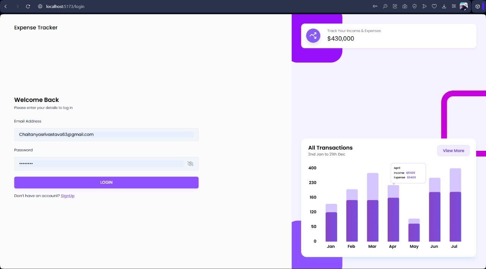
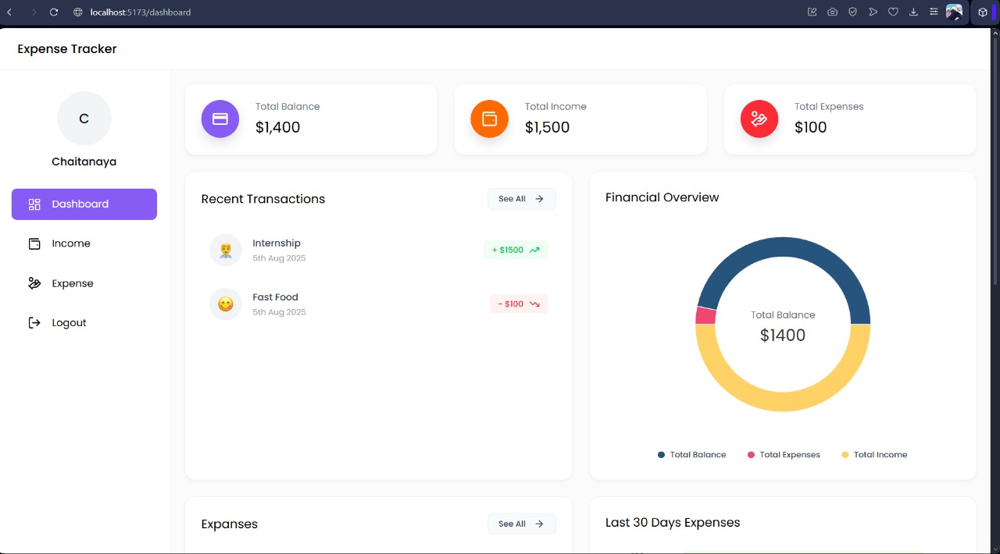
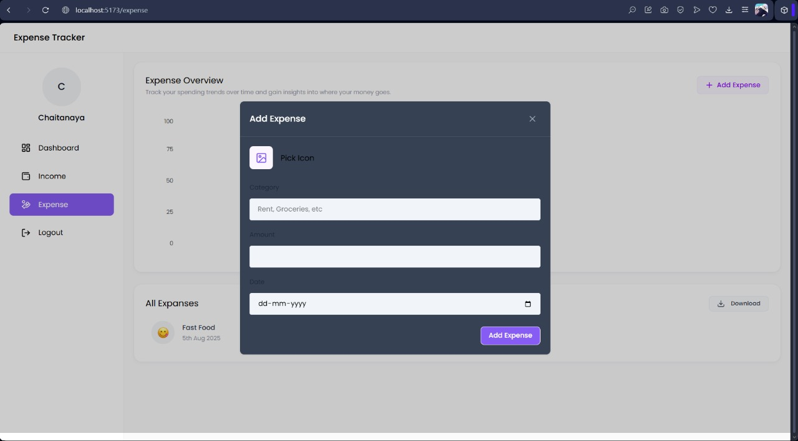
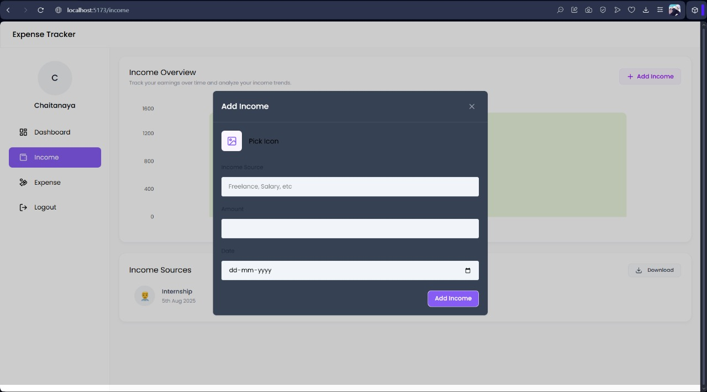
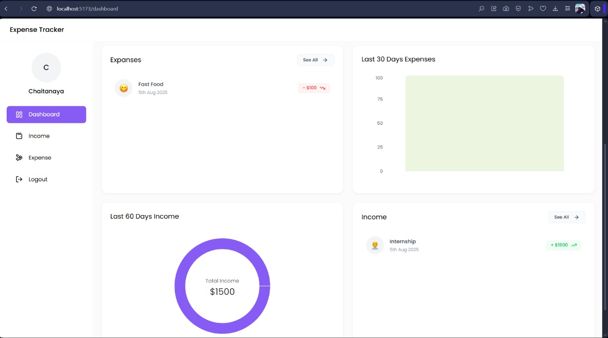
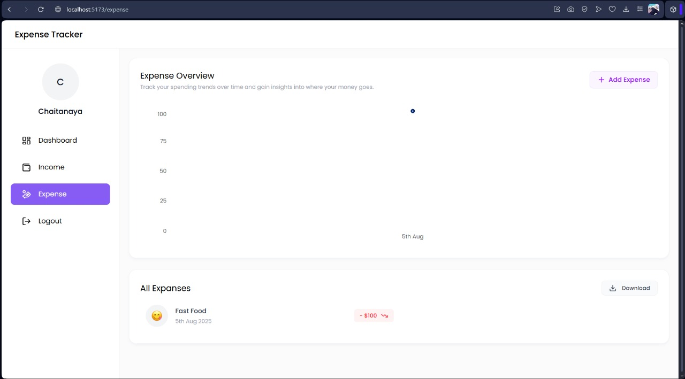

# Expense Tracker

A full-stack **Expense Tracker** web application built using the **MERN stack** (MongoDB, Express, React, Node.js). It helps you **track income, expenses, and get visual financial insights**.

---

## ✨ Features & Functionalities

1. **User Authentication** – Secure login and sign-up using JWT.
2. **Dashboard Overview** – Displays Total Balance, Income, and Expenses in summary cards.
3. **Income Management** – Add, view, delete, and export income sources.
4. **Expense Management** – Add, view, delete, and export categorized expenses.
5. **Interactive Charts** – Visualize income & expense trends (Bar, Pie, Line).
6. **Recent Transactions** – View the latest income and expense records quickly.
7. **Export Reports** – Download income and expense data in Excel format.
8. **Mobile Responsive UI** – Smooth experience across devices.
9. **Sidebar Navigation** – Easy access to Dashboard, Income, Expenses, and Logout.
10. **Quick Delete** – Hover-to-delete feature for income/expense cards.

---

## 📊 Screenshots

### Login

### Dashboard Overview

### Add Expense

### Add Income

### Income Page

### Expense Page

## 🌐 Tech Stack

* **Frontend:** React, Vite, TailwindCSS
* **Backend:** Node.js, Express.js
* **Database:** MongoDB Atlas
* **Authentication:** JWT (JSON Web Token)

---

## ☑️ Future Improvements

* Dark mode toggle
* Budget setting per category
* PDF export reports
* Email monthly summary

---

